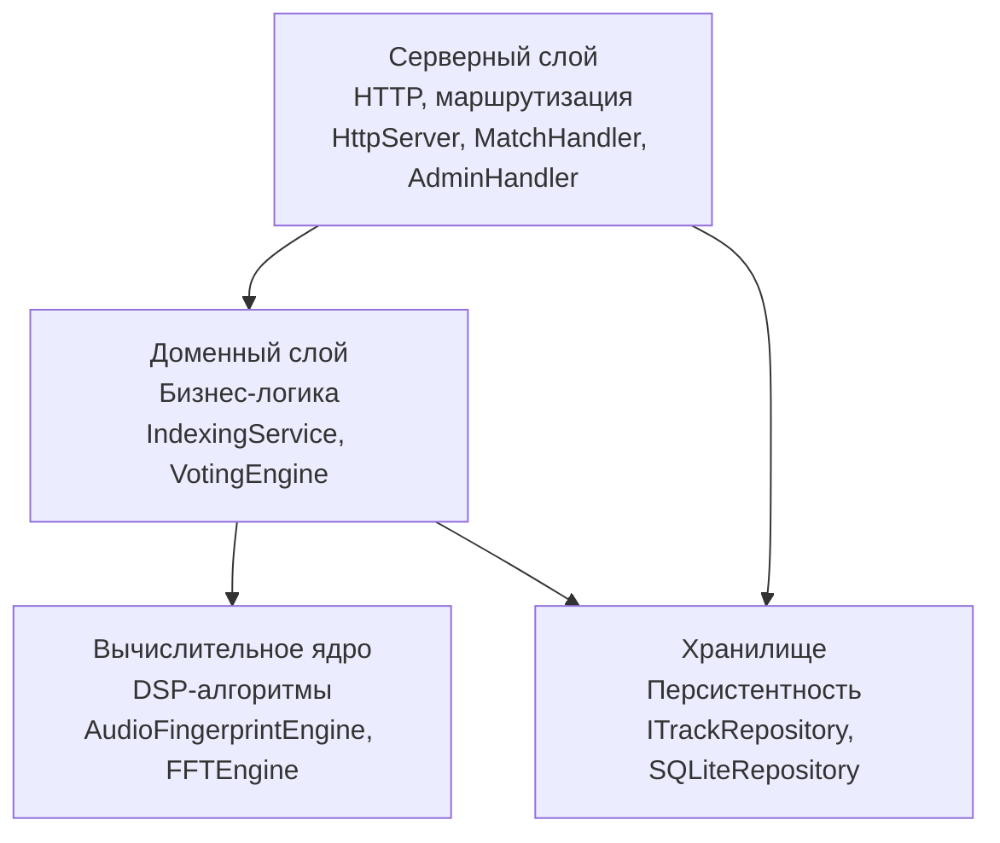
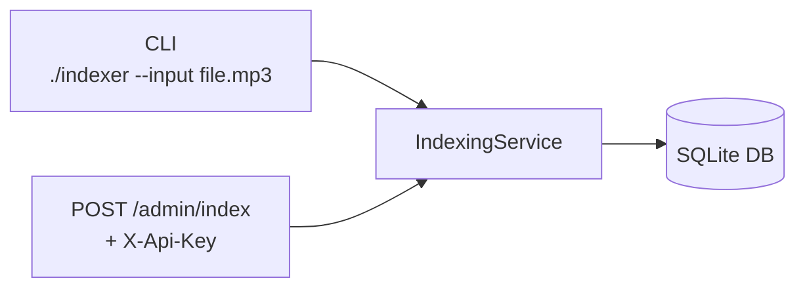
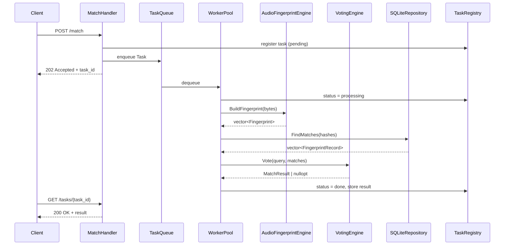
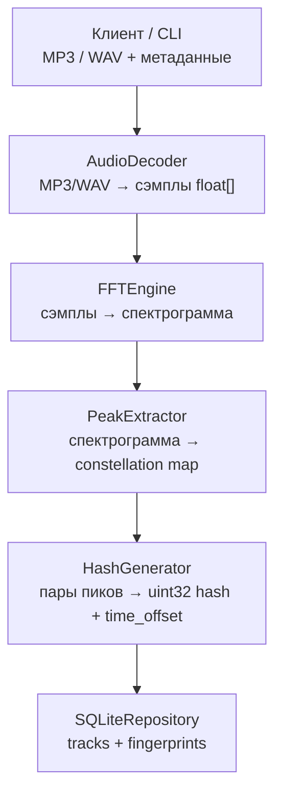
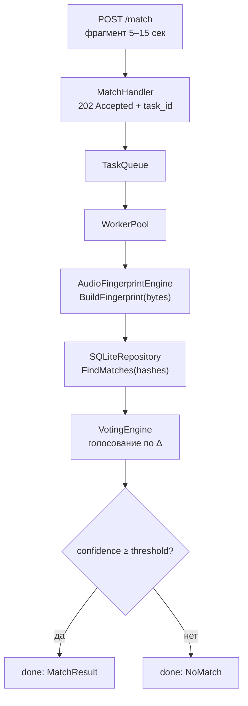
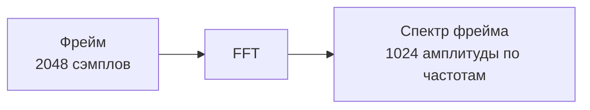
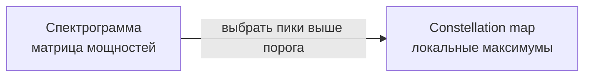
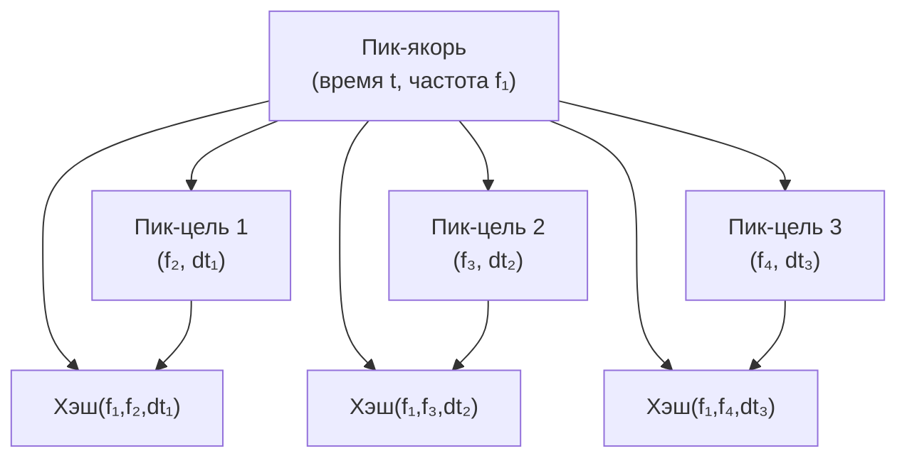
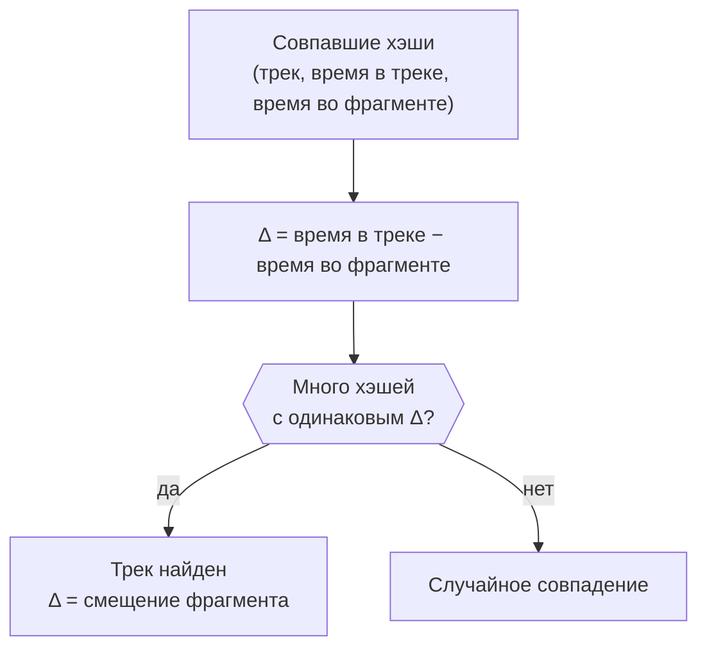
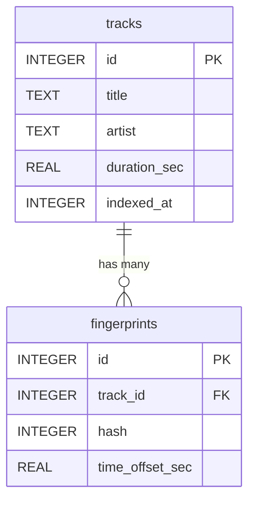

# Архитектурный документ
## Audio Fingerprinting Server

---

# Описание проекта

Серверное приложение на C++, реализующее алгоритм акустической идентификации аудио по принципу Shazam. Система принимает короткий аудиофрагмент, строит его цифровой отпечаток на основе FFT и constellation map, находит совпадение в заранее подготовленной базе хэшей и возвращает результат — название трека, временну́ю позицию совпадения и степень уверенности.

База данных наполняется офлайн: через CLI-инструмент или защищённый административный HTTP-эндпоинт. Конечный пользователь взаимодействует только с операцией матчинга.

**Ключевые свойства системы:**

- Вычислительное ядро (`AudioFingerprintEngine`) отделено от транспорта и хранилища через абстрактные интерфейсы
- Матчинг выполняется асинхронно через пул воркеров — HTTP-поток не блокируется
- Логика индексирования инкапсулирована в `IndexingService` и используется как из CLI, так и из HTTP без дублирования кода

## Стек технологий

| Компонент | Технология |
|---|---|
| Язык | C++20 |
| Сборка | CMake 3.20+ |
| HTTP-сервер | Crow |
| FFT | pocketfft |
| База данных | SQLite3 |
| JSON | nlohmann/json |
| Аудио декодирование | minimp3 + dr_wav |
| Тестирование | Google Test |
| Документация | Doxygen + GitHub Pages |
| CI/CD | GitHub Actions |

Все внешние библиотеки располагаются в `third_party/`.

---

# Требования

## Функциональные требования

### FR-1 — Индексирование аудио

Индексирование является **административной операцией** и недоступно обычным пользователям.

- Система принимает аудиофайл в формате MP3 или WAV
- Декодирует аудио в сэмплы, нарезает на перекрывающиеся фреймы и применяет FFT
- Выделяет локальные пики спектра и строит constellation map
- Из пар пиков генерирует компактные хэши (`uint32_t`)
- Сохраняет хэши и метаданные трека (`title`, `artist`, `duration`) в базу данных
- Доступно через CLI (`./indexer --input <path> --title "..." --artist "..."`) и через `POST /admin/index` с API-ключом в заголовке `X-Api-Key`

### FR-2 — Матчинг фрагмента

- Система принимает аудиофрагмент длиной 5–15 секунд в формате MP3 или WAV
- Строит отпечаток фрагмента по той же схеме, что и при индексировании
- Выполняет поиск совпадающих хэшей в базе данных
- Алгоритмом голосования определяет трек и временну́ю позицию фрагмента внутри него
- Возвращает название трека, смещение в секундах и confidence score
- Запрос обрабатывается **асинхронно**: HTTP-ответ `202 Accepted` с `task_id` возвращается немедленно

### FR-3 — REST API (публичный)

| Метод | Эндпоинт | Описание |
|---|---|---|
| `POST` | `/match` | Загрузить фрагмент (multipart), получить `task_id` |
| `GET` | `/tasks/{id}` | Получить статус и результат задачи |
| `GET` | `/tracks` | Список проиндексированных треков |

### FR-4 — REST API (административный)

| Метод | Эндпоинт | Описание |
|---|---|---|
| `POST` | `/admin/index` | Загрузить трек (multipart + метаданные), требует заголовок `X-Api-Key` |

### FR-5 — Визуализация (опционально, реализуется последней)

Сервер возвращает данные для визуализации как часть ответа на матчинг. Рендеринг выполняется на клиенте через Canvas.

Данные возвращаются поэтапно: спектрограмма и constellation map доступны уже при `status=processing` — воркер кладёт их в `TaskRegistry` сразу после FFT. Scatter plot и результат появляются при `status=done`.

## Нефункциональные требования

### NFR-1 — Производительность

| Операция | Целевое время |
|---|---|
| Индексирование трека 3–5 минут | ≤ 10 секунд |
| Матчинг фрагмента 10 секунд | ≤ 1 секунды |
| Одновременные подключения | ≥ 10 без деградации отклика |

### NFR-2 — Надёжность

- Некорректный файл не приводит к аварийному завершению сервера — клиент получает `400 Bad Request` с описанием ошибки
- База данных защищена от повреждения: SQLite WAL mode + транзакции
- Гонки данных исключены: между процессами — через SQLite WAL, внутри процесса — через `std::mutex` в `SQLiteRepository`

### NFR-3 — Портируемость

- Целевая платформа: Linux (Ubuntu 22.04+)
- Единственная точка входа для сборки: CMake
- Все зависимости подключаются через `FetchContent` или поставляются как header-only

### NFR-4 — Сопровождаемость

- Публичные интерфейсы покрыты Doxygen-комментариями
- Архитектура слоистая: слои взаимодействуют только через абстрактные интерфейсы
- Каждый push запускает CI-pipeline: сборка → тесты

### NFR-5 — Наблюдаемость

- Все входящие запросы и ошибки логируются в `stdout` с временно́й меткой
- Статус задачи всегда доступен через `GET /tasks/{id}`

---

# Архитектура

## Слоистая архитектура

Система разделена на четыре слоя. Зависимости направлены строго сверху вниз; взаимодействие между слоями — только через интерфейсы.



| Слой | Ответственность | Ключевые классы |
|---|---|---|
| Server | HTTP-транспорт, маршрутизация, авторизация | `HttpServer`, `MatchHandler`, `AdminHandler` |
| Domain | Бизнес-логика, оркестрация операций | `IndexingService`, `VotingEngine` |
| Core / DSP | Вычислительное ядро, DSP-алгоритмы | `AudioFingerprintEngine`, `FFTEngine`, `HashGenerator` |
| Storage | Персистентность, абстракция хранилища | `ITrackRepository`, `SQLiteRepository` |

## Два входа для индексирования

Логика индексирования инкапсулирована в `IndexingService`. Сервис вызывается из двух контекстов без дублирования кода.



## Асинхронная обработка



## Синхронизация доступа к БД

| Уровень | Проблема | Решение |
|---|---|---|
| Между процессами | CLI и HTTP-сервер пишут одновременно | SQLite WAL mode |
| Внутри процесса | Воркеры читают, AdminHandler пишет | `std::mutex` в `SQLiteRepository` |

---

# Поток данных

## Индексирование трека



| Шаг | Вход | Выход | Класс |
|---|---|---|---|
| Декодирование | Байты MP3/WAV | `vector<float>` сэмплов | `AudioDecoder` |
| FFT | Сэмплы, фреймы 2048 | Матрица лог-амплитуд | `FFTEngine` |
| Пики | Спектрограмма | `vector<Peak>` | `PeakExtractor` |
| Хэши | Пары пиков | `vector<Fingerprint>` | `HashGenerator` |
| Запись | Fingerprints + метаданные | Строки в SQLite | `SQLiteRepository` |

Один трек 3 минуты → ~10 000–20 000 хэшей → ~150–300 КБ в БД.

## Матчинг фрагмента



| Статус | Когда устанавливается |
|---|---|
| `pending` | Сразу при регистрации в `TaskRegistry` |
| `processing` | Воркер взял задачу из очереди |
| `done` | Вычисления завершены |
| `error` | Исключение при декодировании или обработке |

---

# Алгоритмы

## Спектрограмма

Аудиосигнал представляет собой зависимость амплитуды от времени. Такое представление неудобно для поиска паттернов: два одинаковых трека с разной громкостью дают разные амплитуды, а шум накладывается непосредственно на сигнал.

Спектрограмма — это трёхмерное представление сигнала по осям времени, частоты и мощности. На таком представлении характерные паттерны сохраняются при изменении громкости, лёгком шуме и сжатии аудио.

## Дискретное преобразование Фурье и FFT

Преобразование Фурье раскладывает сигнал на набор синусоид разных частот. Для дискретного сигнала применяется его дискретная версия — ДПФ. Быстрое преобразование Фурье (FFT) — алгоритм вычисления ДПФ со сложностью O(n log n) вместо O(n²).

**Шаг 1 — нарезка на фреймы с перекрытием**

Сигнал нарезается на фреймы фиксированной длины. Каждый следующий фрейм сдвинут относительно предыдущего на 1024 сэмпла (50% overlap). Перекрытие необходимо, чтобы события на границах фреймов не терялись.

**Шаг 2 — FFT на каждом фрейме**



Из 2048 сэмплов получается 1024 амплитуды — вторая половина симметрична первой для вещественного сигнала и отбрасывается.

**Шаг 3 — сборка спектрограммы**

Спектры всех фреймов укладываются в матрицу (число фреймов) × 1024. Значение каждой ячейки — мощность на данной частоте в данный момент времени.

## Constellation map

Прямое сравнение спектрограмм вычислительно дорого и неустойчиво к шуму. Вместо этого из спектрограммы извлекаются только локальные максимумы — точки, мощность которых превышает мощность всех соседей в некоторой окрестности по времени и частоте.



## Хэши

Пики заданы координатами (время, частота). Сравнивать их напрямую ненадёжно — мелкие искажения смещают координаты. Решение — кодировать не отдельный пик, а пару пиков.

Для каждого пика-якоря перебираются пики-цели в временно́м окне после него. Каждая пара кодируется в одно число — хэш, — содержащее частоту якоря, частоту цели и временной интервал между ними.



Абсолютное время якоря в хэш не входит. Оно сохраняется в базе данных **отдельно** и используется на этапе голосования.

## Голосование

При матчинге фрагмент проходит тот же пайплайн. Полученные хэши ищутся в базе данных. Для каждого совпавшего хэша известны две временны́е метки: позиция якоря в треке (из базы) и позиция якоря во фрагменте. Их разность — Δ — равна смещению фрагмента относительно начала трека.

Если фрагмент действительно взят из данного трека, то Δ одинаково для всех совпавших хэшей. Случайные совпадения дают случайные Δ, которые не концентрируются в одной точке.



## Confidence score

Результат голосования сопровождается оценкой уверенности — отношением числа голосов победителя к общему числу хэшей фрагмента. Если это отношение ниже порогового значения, система возвращает отсутствие совпадения.

---

# База данных

## Схема



Поле `time_offset_sec` — время якорного пика в треке. Используется при голосовании для вычисления Δ.

## Индексы

- по полю `hash` — основной, для быстрого поиска при матчинге
- по полю `track_id` — вспомогательный, для каскадного удаления

## Конкурентный доступ

SQLite работает в режиме WAL (Write-Ahead Logging). Читатели и писатели не блокируют друг друга — воркеры могут выполнять поиск пока CLI-процесс индексирует новый трек.

## Оценка объёма

| | |
|---|---|
| Хэшей на трек (3 мин) | ~10 000–20 000 |
| Размер трека в БД | ~200–400 КБ |
| 1 000 треков | ~200–400 МБ |

---

# REST API

## Публичные эндпоинты

| Метод | Эндпоинт | Описание |
|---|---|---|
| `POST` | `/match` | Загрузить фрагмент, получить идентификатор задачи |
| `GET` | `/tasks/{id}` | Получить статус и результат задачи |
| `GET` | `/tracks` | Список проиндексированных треков |

### POST /match

Принимает аудиофрагмент в формате MP3 или WAV. Возвращает идентификатор задачи немедленно.

```json
{ "task_id": "a3f1c2d4e5b6" }
```

### GET /tasks/{id}

**Совпадение найдено:**
```json
{
  "task_id": "a3f1c2d4e5b6",
  "status": "done",
  "result": {
    "track": { "id": 7, "title": "Bohemian Rhapsody", "artist": "Queen", "duration_sec": 354.5 },
    "offset_sec": 42.3,
    "confidence": 0.87,
    "votes": 214
  }
}
```

**Совпадение не найдено:**
```json
{ "task_id": "a3f1c2d4e5b6", "status": "done", "result": null }
```

## Административные эндпоинты

### POST /admin/index

Принимает аудиофайл и метаданные трека. Требует API-ключ в заголовке `X-Api-Key`.

## Коды ошибок

| Код | Описание |
|---|---|
| `400` | Неверный запрос — отсутствует файл, неверный формат или метаданные |
| `401` | Неверный или отсутствующий `X-Api-Key` |
| `404` | Задача с указанным идентификатором не найдена |
| `413` | Файл превышает допустимый размер |

---

# Тестирование

Тестирование организовано на трёх уровнях: юнит, интеграционные и end-to-end. Фреймворк — Google Test, интегрируется через `FetchContent`.

## Юнит тесты

| Компонент | Что проверяется |
|---|---|
| `HashGenerator` | Корректность упаковки трёх чисел в `uint32_t`; обратимость кодирования |
| `FFTEngine` | Синус на частоте F даёт пик спектра на частоте F; нулевой сигнал даёт нулевой спектр |
| `PeakExtractor` | Спектр с известными максимумами даёт правильные пики; контроль плотности работает корректно |
| `VotingEngine` | Известный набор совпадений даёт правильный трек и корректный confidence; результат ниже порога возвращает отсутствие совпадения |

## Интеграционные тесты

| Сценарий | Что проверяется |
|---|---|
| `IndexingService` + мок-репозиторий | Трек и хэши сохраняются с корректными данными |
| `WorkerPool` + `TaskQueue` | Задача проходит очередь; результат появляется в `TaskRegistry` |
| `AdminHandler` — неверный ключ | Ответ `401`; индексирование не запускается |
| `MatchHandler` | Идентификатор задачи присутствует в ответе; задача зарегистрирована |

## End-to-end тест

Проверяет весь пайплайн целиком без реальных аудиофайлов. Используется синтетический сигнал — сумма синусов на известных частотах. Тест полностью детерминирован и воспроизводим в CI.

Сценарий: сгенерировать сигнал → проиндексировать → взять фрагмент из середины → прогнать через полный пайплайн → проверить что найден правильный трек, confidence выше порога, смещение совпадает с ожидаемым.

---

# Архитектурные решения

## SQLite вместо PostgreSQL

Для хранения хэшей выбрана встраиваемая база данных SQLite. Она не требует отдельного процесса, хранит все данные в одном файле и поддерживает режим WAL. При нагрузке до 10 параллельных пользователей этого достаточно. Переход на PostgreSQL при необходимости не потребует изменений в бизнес-логике — достаточно написать новую реализацию `ITrackRepository`.

## pocketfft вместо FFTW

FFTW требует системной установки и распространяется под лицензией GPL. pocketfft — header-only библиотека с лицензией MIT, которая автоматически использует SIMD-инструкции при компиляции с оптимизациями. Вся FFT-логика изолирована в `FFTEngine` — замена библиотеки не затрагивает остальной код.

## Crow вместо Boost.Beast

Boost.Beast требует значительного количества низкоуровневого кода для реализации базовых HTTP-операций. Crow предоставляет более высокоуровневый интерфейс, поставляется как header-only и поддерживает multipart-запросы для загрузки аудиофайлов.

## 32-битный хэш

Хэш кодирует три числа: частоту якоря (9 бит), частоту цели (9 бит) и временной интервал между ними (14 бит). Сумма составляет ровно 32 бита без потерь. 16-битный хэш даёт слишком много коллизий; 64-битный вдвое увеличивает объём базы данных.

## Асинхронный матчинг

Построение отпечатка и поиск по базе данных — вычислительно нетривиальная операция. Синхронная обработка блокировала бы HTTP-поток, что при нескольких параллельных запросах приводит к деградации отклика. `POST /match` регистрирует задачу и немедленно возвращает идентификатор; результат доступен через `GET /tasks/{id}`.

## Относительный порог отбора пиков

Абсолютный порог амплитуды не работает: для тихих треков он отсекает все пики, для громких пропускает шум. Порог вычисляется относительно медианы спектрограммы конкретного фрагмента — это обеспечивает стабильное количество пиков независимо от уровня громкости.

---

# Возможные улучшения

## Без изменения архитектуры

**Поддержка дополнительных форматов.** Расширение на FLAC и OGG затрагивает только `AudioDecoder`.

**Контейнеризация.** Упаковка сервера в Docker упрощает развёртывание и воспроизводимость среды.

**Мониторинг.** Экспорт метрик (latency матчинга, размер очереди) через отдельный эндпоинт.

## Расширение архитектуры

**Распознавание в реальном времени.** Клиент передаёт аудио по WebSocket непрерывным потоком, сервер применяет скользящее окно и возвращает результат как только уверенность превышает порог. Вычислительное ядро не требует изменений.

**Кэширование хэшей.** При высокой нагрузке горячие хэши можно вынести в кэш через новую обёртку над `ITrackRepository` без изменения бизнес-логики.

**Переход на PostgreSQL.** Актуально при росте базы до миллионов треков или при горизонтальном масштабировании.

## Смена стека

**GPU-ускорение FFT.** При индексировании больших каталогов FFT становится узким местом. Переход на GPU-реализацию изолирован в `FFTEngine`.

**Приближённый поиск.** При миллионах треков точный перебор по хэшам перестаёт укладываться в требования по времени. Приближённый поиск ближайших соседей решает эту проблему ценой замены `FindMatches` в репозитории.

---

# Критерии завершения

Проект считается завершённым при выполнении **всех** следующих условий.

## Функциональность

- [ ] Индексирование работает через CLI (`./indexer`) и через `POST /admin/index`
- [ ] Матчинг фрагмента возвращает корректный трек с confidence score и временно́й позицией
- [ ] REST API (`/match`, `/tasks/{id}`, `/tracks`) работает стабильно
- [ ] Асинхронная обработка: `POST /match` возвращает `202` немедленно
- [ ] Визуализация: спектрограмма и constellation map возвращаются при `status=processing`, scatter plot при `status=done`

## База данных

- [ ] Demo-база содержит не менее 15 проиндексированных треков

## Сборка и CI

- [ ] Сборка проходит через CMake на Ubuntu 22.04
- [ ] CI-pipeline: сборка + тесты на каждый push

## Тестирование

- [ ] Все юнит тесты проходят
- [ ] Все интеграционные тесты проходят
- [ ] E2e тест на синтетическом сигнале проходит

## Документация

- [ ] Публичные интерфейсы покрыты Doxygen-комментариями
- [ ] Документация опубликована на GitHub Pages
