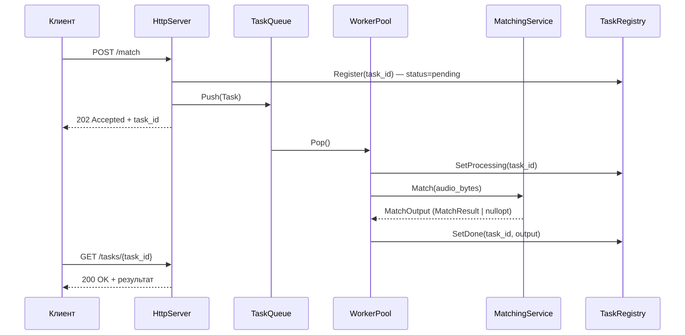

@page architecture Архитектура

[TOC]

@section arch_layers Слоистая архитектура

Система разделена на четыре слоя. Зависимости направлены строго сверху вниз;
взаимодействие между слоями — только через абстрактные интерфейсы.

| Слой | Ответственность | Ключевые классы |
|---|---|---|
| Server | HTTP-транспорт, маршрутизация, авторизация, очередь задач | `HttpServer`, `TaskQueue`, `TaskRegistry`, `WorkerPool` |
| Domain | Бизнес-логика, координация операций | `IndexingService`, `MatchingService` |
| Core / DSP | Вычислительное ядро, DSP-алгоритмы | `AudioFingerprintEngine`, `FftEngine`, `PeakExtractor`, `HashGenerator`, `VotingEngine` |
| Storage | Абстракция хранилища и её реализация | `ITrackRepository`, `SQLiteRepository` |

Domain-слой не знает о Crow или SQLite напрямую: `MatchingService` и
`IndexingService` работают с `ITrackRepository` — абстрактным интерфейсом,
который реализует `SQLiteRepository`. Замена БД потребует только новой
реализации интерфейса, без изменений в `domain/` или `core/`.

@section arch_indexing_entry Два входа для индексирования

Логика индексирования инкапсулирована в `IndexingService` и вызывается из
двух контекстов без дублирования кода: CLI-инструмента `indexer` и
административного HTTP-эндпоинта.

@section arch_async Асинхронная обработка распознавания

`POST /match` не ждёт результата: `HttpServer` регистрирует задачу в
`TaskRegistry`, кладёт её в `TaskQueue` и немедленно отвечает `202 Accepted` с
`task_id`. Один из потоков `WorkerPool` забирает задачу из очереди, прогоняет
её через `MatchingService` и записывает результат обратно в `TaskRegistry`.
Клиент опрашивает `GET /tasks/{id}`, пока статус не станет `done` или `error`.

@section arch_db_sync Синхронизация доступа к БД

| Уровень | Проблема | Решение |
|---|---|---|
| Между процессами | CLI (`indexer`) и HTTP-сервер пишут одновременно | SQLite WAL mode |
| Внутри процесса | Воркеры читают, admin-эндпоинт пишет | `std::mutex` в `SQLiteRepository` |

@section arch_dataflow_index Поток данных: индексирование трека

| Шаг | Вход | Выход | Класс |
|---|---|---|---|
| Декодирование | Байты MP3/WAV | `vector<float>` сэмплов | `AudioDecoder` |
| FFT | Сэмплы, фреймы по 2048 | Спектрограмма (лог-мощность) | `FftEngine` |
| Пики | Спектрограмма | `vector<Peak>` (constellation map) | `PeakExtractor` |
| Хэши | Пары пиков | `vector<Fingerprint>` | `HashGenerator` |
| Запись | Fingerprints + метаданные | Строки в SQLite | `SQLiteRepository` |

Весь пайплайн от сэмплов до fingerprints собран в фасаде
`AudioFingerprintEngine::Process()` — и индексирование, и распознавание
используют один и тот же код, поэтому отпечаток фрагмента гарантированно
сравним с отпечатком, сохранённым при индексировании.

@section arch_dataflow_match Поток данных: распознавание фрагмента

| Статус | Когда устанавливается |
|---|---|
| `pending` | Сразу при регистрации в `TaskRegistry` |
| `processing` | Воркер взял задачу из очереди |
| `done` | Вычисления завершены (с результатом или без) |
| `error` | Исключение при декодировании или обработке |

@section arch_algorithms Алгоритмы

@subsection arch_algo_spectrogram Спектрограмма

Амплитуда сигнала во времени — неудобное представление для поиска паттернов:
один и тот же трек с разной громкостью даёт разные амплитуды, а шум
накладывается прямо на сигнал. Спектрограмма раскладывает сигнал по осям
времени, частоты и мощности — характерные паттерны в этом представлении
устойчивы к изменению громкости, лёгкому шуму и сжатию аудио.

`FftEngine` строит спектрограмму в три шага:

1. **Нарезка на перекрывающиеся фреймы.** Сигнал делится на фреймы по
   `frame_size_` сэмплов (по умолчанию 2048), каждый следующий сдвинут на
   `hop_size_` сэмплов (по умолчанию 1024 — 50% перекрытие). Перекрытие нужно,
   чтобы события на границах фреймов не терялись.
2. **Оконное сглаживание и FFT на каждом фрейме.** Фрейм умножается на окно
   Ханна, затем к нему применяется вещественное FFT (pocketfft r2c). Из
   `frame_size_` вещественных сэмплов получается `frame_size_ / 2 + 1`
   комплексных бинов; DC- и Найквист-бины отбрасываются, остаётся
   `frame_size_ / 2` бинов — см. `FftEngine::NumBins()`.
3. **Сборка спектрограммы.** Логарифмическая мощность (`10 * log10(power +
   ε)`) каждого фрейма укладывается в строку матрицы `Spectrogram`, хранимой
   row-major: `(число фреймов) × NumBins()`.

@subsection arch_algo_constellation Constellation map

Прямое сравнение спектрограмм дорого и неустойчиво к шуму. Вместо этого
`PeakExtractor` извлекает только локальные максимумы — точки, чья мощность
строго больше мощности всех соседей в окне `(2·frame_radius_+1) ×
(2·bin_radius_+1)` вокруг них, — и отбирает те, что превышают порог
`медиана(фрейма) + offset_db_`.

Плотность пиков дополнительно контролируется по зонам и частотным полосам
(см. @ref arch_freq_bands): в каждой зоне из `zone_frames_` фреймов на каждую
полосу оставляется не более `peaks_per_band_` самых громких пиков. Это не
даёт громким низкочастотным долям заглушить более тихие, но информативные
высокочастотные пики — без этого constellation map вырождался бы в набор
пиков из одной-двух полос.

@subsection arch_algo_hashes Хэши

Пик задан координатами (время, частота). Сравнивать пики по отдельности
ненадёжно — мелкие искажения слегка смещают координаты. `HashGenerator`
решает это, кодируя не отдельный пик, а пару: для каждого пика-якоря
перебираются пики-цели в окне до `max_target_offset_` фреймов после него (не
более `max_targets_per_anchor_` целей на якорь), и пара упаковывается в один
`uint32_t`:

Абсолютное время якоря в хэш не входит — оно сохраняется в БД отдельно
(`Fingerprint::anchor_frame_`) и используется на этапе голосования.

@subsection arch_algo_voting Голосование (two-level: track → delta)

При распознавании фрагмент проходит тот же пайплайн, и полученные хэши
ищутся в базе. Для каждого совпавшего хэша известны две временны́е метки:
позиция якоря в треке (из БД) и позиция якоря во фрагменте. Их разность —
**Δ** — равна смещению фрагмента относительно начала трека. Если фрагмент
действительно взят из этого трека, Δ одинаково для всех его совпавших хэшей;
случайные совпадения дают случайные, не концентрирующиеся Δ.

`VotingEngine::Vote()` считает голоса в два уровня, а не в один общий
подсчёт по всем парам `(track_id, Δ)`:

1. **Внутри трека** — среди всех Δ данного трека выбирается лучшая (с
   наибольшим числом голосов) пара `(track_id, Δ)`. Остальные Δ того же
   трека (шумовые совпадения на других смещениях) в дальнейшем сравнении не
   участвуют.
2. **Между треками** — лучшие пары разных треков сравниваются друг с другом;
   голоса победителя и второго места по этому сравнению становятся
   `votes_` и `runner_up_` в `MatchResult`.

Такое разделение принципиально: без него второй по силе пик Δ **того же**
правильного трека мог бы сам оказаться "runner-up" и искусственно занизить
`score_` (отношение `votes_ / runner_up_`), хотя реальный конкурент —
случайный шум от других треков — гораздо слабее.

Результат сопровождается `score_` — отношением голосов победителя к голосам
второго места (`+∞`, если конкурентов не было). Итог засчитывается только
если голосов не меньше `min_votes_` **и** `score_` не меньше
`min_score_ratio_` — оба условия задаются в `VotingEngineConfig`.

@subsection arch_freq_bands Частотные полосы

`PeakExtractor::GetFrequencyBands()` делит спектр на 8 полос — логарифмическое
разбиение, примерно соответствующее музыкально значимым диапазонам (при
`frame_size_=2048`, `sr=44100`):

| Полоса (бины) | Частота | Название |
|---|---|---|
| [1, 4) | ~21–86 Гц | суб-бас |
| [4, 8) | ~86–172 Гц | бас |
| [8, 16) | ~172–344 Гц | низ-середина |
| [16, 32) | ~344–688 Гц | середина |
| [32, 64) | ~688–1377 Гц | верх-середина |
| [64, 128) | ~1377–2754 Гц | присутствие |
| [128, 256) | ~2754–5511 Гц | яркость |
| [256, 512) | ~5511–11025 Гц | воздух |

Контроль плотности пиков (`PeakExtractor::ApplyDensityControl`) применяется
отдельно в каждой паре (зона, полоса) — см. @ref arch_algo_constellation.
Бины с индексом 512 и выше в полосы не попадают и в хэшировании не
участвуют — `HashGeneratorConfig::freq_bin_limit_` отбрасывает их ещё на
этапе `HashGenerator::Generate()`.

@section arch_decisions Архитектурные решения

@subsection arch_dec_sqlite SQLite вместо PostgreSQL

Встраиваемая база не требует отдельного процесса, хранит все данные в одном
файле и поддерживает режим WAL. Для нагрузки в единицы-десятки параллельных
клиентов этого достаточно. Переход на PostgreSQL при необходимости не
затронет бизнес-логику — нужна лишь новая реализация `ITrackRepository`.

@subsection arch_dec_pocketfft pocketfft вместо FFTW

FFTW требует системной установки и распространяется под GPL. pocketfft —
header-only библиотека под MIT, автоматически использующая SIMD при сборке с
оптимизациями. Вся FFT-логика изолирована в `FftEngine` — замена библиотеки
не затронет остальной код.

@subsection arch_dec_crow Crow вместо Boost.Beast

Boost.Beast требует много низкоуровневого кода для базовых HTTP-операций.
Crow даёт более высокоуровневый интерфейс, header-only и поддерживает
multipart-запросы, нужные для загрузки аудиофайлов.

@subsection arch_dec_hash32 32-битный хэш

Хэш кодирует три числа: частоту якоря (9 бит), частоту цели (9 бит) и
временной интервал между ними (14 бит) — ровно 32 бита без потерь (см.
`HashGenerator::PackHash`). 16-битный хэш давал бы слишком много коллизий;
64-битный вдвое увеличил бы объём базы данных.

@subsection arch_dec_async Асинхронное распознавание

Построение отпечатка и поиск по базе — вычислительно нетривиальная операция.
Синхронная обработка блокировала бы HTTP-поток и при нескольких параллельных
запросах привела бы к деградации отклика. `POST /match` только регистрирует
задачу и немедленно возвращает `task_id`; результат — через `GET
/tasks/{id}`.

@subsection arch_dec_threshold Относительный порог отбора пиков

Абсолютный порог амплитуды не работает: для тихих треков он отсекает все
пики, для громких пропускает шум. Порог `PeakExtractor` вычисляет
относительно медианы конкретного фрейма — это даёт стабильную плотность
пиков независимо от уровня громкости записи.
