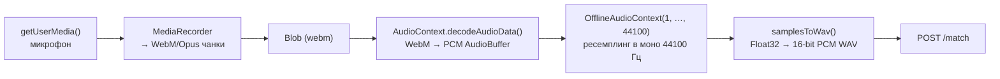

@page web_client Веб-клиент

[TOC]

@section wc_overview Обзор

`static/index.html` — самодостаточная страница (HTML + CSS + JS без сборки и
без внешних зависимостей), которую `HttpServer` отдаёт на `GET /`. Она
позволяет либо записать звук с микрофона, либо загрузить файл, отправляет
его на `POST /match`, опрашивает результат через `GET /tasks/{id}` и
отображает совпадение вместе со спектром сигнала.

@section wc_ui Интерфейс

- **Кнопка-микрофон** (`#listen-btn`) — тап начинает запись
  (`startRecording()`), повторный тап или истечение `MAX_RECORDING_SEC`
  (20 секунд) её останавливает (`stopRecording()`). Во время записи кнопка
  получает класс `recording` (визуальная индикация) и появляется область
  визуализации спектра.
- **Кнопка "or upload a file"** (`#upload-btn`) открывает системный диалог
  выбора файла (`accept="audio/*"`) — альтернатива записи с микрофона.
- **Область визуализации** (`#viz-area`, `<canvas id="spectrum-canvas">`) —
  во время записи рисует живой спектр в реальном времени, после отправки —
  усреднённый спектр всего фрагмента.
- **Строка статуса** (`#status-text`) — "Converting audio...", "Analyzing
  audio...", "Identifying" (с анимацией точек, пока идёт поллинг).
- **Карточка результата** (`#result-card`) — при совпадении показывает
  название трека, исполнителя, позицию в треке (сек), score и число
  голосов; при отсутствии совпадения — "No match found". Кнопка "Try again"
  сбрасывает интерфейс.

@section wc_recording Запись через MediaRecorder и конвертация в WAV

Сервер и DSP-пайплайн понимают только MP3 и WAV, а браузер записывает микрофон
в WebM/Opus (`MediaRecorder`) — поэтому перед отправкой аудио перекодируется
на клиенте.




Загруженный через кнопку "upload a file" файл идёт в `processAudio()`
напрямую, без этой конвертации — предполагается, что пользователь загружает
уже готовый MP3/WAV.

@section wc_viz Визуализация спектра

Используется чистый Web Audio API + Canvas 2D, без сторонних библиотек:

- **Во время записи** (`drawLiveSpectrum()`) — `AnalyserNode`
  (`fftSize = 512`, `smoothingTimeConstant = 0.75`) подключён к источнику
  микрофона; на каждый кадр (`requestAnimationFrame`) считываются частотные
  данные и рисуются столбиками на `<canvas>`.
- **После отправки** (`renderStaticSpectrum()`) — по всему записанному/
  загруженному фрагменту вычисляется усреднённый спектр (в файле реализовано
  собственное радиксное FFT на JS, без Web Audio, чтобы работать и с уже
  декодированными сэмплами оффлайн) и рисуется статический график.

Оба режима используют один и тот же `<canvas id="spectrum-canvas">` и
масштабируются с учётом `devicePixelRatio` (`setupCanvas()`) — на экранах с
высокой плотностью пикселей график остаётся чётким.

@section wc_api Взаимодействие с REST API

`API_BASE = window.location.origin` — клиент всегда обращается к серверу,
который его отдал.

| Шаг | Запрос | Ответ |
|---|---|---|
| 1. Отправить фрагмент | `POST /match`, `multipart/form-data`, поле `file` | `{ "task_id": "..." }` |
| 2. Опросить статус | `GET /tasks/{task_id}`, до 60 раз с паузой 500 мс (`pollResult()`) | `{ "task_id", "status", "result" }` |

`status` принимает значения `pending`, `processing`, `done`, `error`.
Поллинг останавливается на первом `done` (успех/отсутствие совпадения) или
`error` (бросает исключение с текстом ошибки); после 60 попыток (30 секунд)
клиент показывает таймаут.

При `status: "done"` и найденном треке `result` содержит:

```json
{
  "track": { "id": 7, "title": "...", "artist": "...", "duration_sec": 354.5 },
  "offset_frames": 1820,
  "votes": 214,
  "runner_up": 3,
  "score": 71.3
}
```

Клиент переводит `offset_frames` в секунды по формуле
`offset_frames * hop_size / sample_rate` (в коде — константы `1024` и
`44100`, совпадающие со значениями по умолчанию `FftEngineConfig::hop_size_`
и частотой ресемплинга; если конфиг сервера меняет `hop_size`, эту формулу в
`showResult()` нужно обновить). При `result: null` показывается "No match
found".

@section wc_run Как запустить

Отдельной сборки не требуется — страница статическая и раздаётся самим
сервером:

```bash
./build/acoustid_server --config config.json
# затем открыть в браузере:
# http://localhost:8080/
```

Запись с микрофона требует доступа по HTTPS или `localhost` — ограничение
браузеров на `getUserMedia()`, не специфичное для этого проекта.
