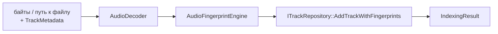
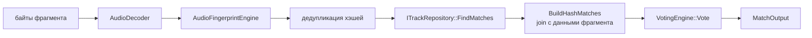

@page module_domain Модуль domain

[TOC]

@section domain_purpose Назначение

`domain/` — слой бизнес-логики. Он координирует работу `audio` и `core`
(декодирование → DSP), обращается к хранилищу через абстрактный интерфейс
`ITrackRepository` и не знает ничего ни про HTTP (Crow), ни про конкретную
реализацию БД (SQLite). Это единственный слой, который одновременно
используется и из CLI (`indexer`), и из HTTP-сервера — без дублирования
логики.

@section domain_classes Классы

| Класс / структура | Роль |
|---|---|
| `IndexingService` | Индексирование трека: декодирование → DSP → запись в БД |
| `MatchingService` | Распознавание фрагмента: декодирование → DSP → поиск в БД → голосование |
| `ITrackRepository` | Абстрактный интерфейс хранилища треков и fingerprints |
| `TrackMetadata` / `TrackInfo` | Метаданные трека на входе / на выходе |
| `HashLookupResult` | Результат поиска одного хэша в БД |
| `IndexingResult` | Результат индексирования (track_id + число fingerprints) |
| `MatchOutput` / `MatchDiagnostics` | Результат распознавания + диагностика пайплайна |

@section domain_dataflow Data flow

**Индексирование** (`IndexingService::IndexFromBytes` / `IndexFromFile`):



**Распознавание** (`MatchingService::Match`):



Хэши фрагмента дедуплицируются перед запросом в БД (`std::unordered_set` в
`MatchingService::Match`): если один и тот же хэш встречается во фрагменте
несколько раз (что обычно для повторяющихся музыкальных паттернов),
`FindMatches` без дедупликации вернул бы совпадения кратно — раздувая число
`HashMatch` квадратично и заглушая полезный сигнал шумом одинаковых пар.

@section domain_usage Пример использования

```cpp
#include "domain/indexing_service.h"
#include "domain/matching_service.h"

aid::domain::IndexingService indexing(decoder, engine, repository);
auto result = indexing.IndexFromFile("track.mp3", {"Title", "Artist", 0.0F});
// result.track_id, result.fingerprint_count

aid::domain::MatchingService matching(decoder, engine, repository, voter);
aid::domain::MatchOutput out = matching.Match(fragment_bytes);
if (out.match_result) {
    // out.match_result->track_id_, ->offset_frames_, ->score_
}
```

@section domain_deps Зависимости

- Зависит от `audio` (`AudioDecoder`) и `core` (`AudioFingerprintEngine`,
  `VotingEngine`, типы `Fingerprint`/`HashMatch`).
- Определяет, но не реализует хранилище — `ITrackRepository` реализует
  `storage::SQLiteRepository`; конкретный тип передаётся через ссылку на
  интерфейс, поэтому `domain` не зависит от `storage` напрямую (зависимость
  инвертирована).
- От `domain` зависят `server` (использует `IndexingService` и
  `MatchingService` в HTTP-обработчиках и в `WorkerPool`) и CLI-инструмент
  `indexer` (`main_indexer.cpp`).
