@page module_server Модуль server

[TOC]

@section server_purpose Назначение

`server/` — HTTP-транспорт и конкурентность: маршрутизация запросов (Crow),
авторизация административных операций, потокобезопасная очередь задач и пул
воркеров, разгружающих HTTP-поток от вычислительно тяжёлого распознавания.
Модуль зависит от `domain`, но `domain` о `server` ничего не знает.

@section server_classes Классы

| Класс / структура | Роль |
|---|---|
| `HttpServer` | Маршрутизация (Crow), обработчики запросов, авторизация admin-эндпоинтов |
| `HttpServerConfig` | Параметры сервера: порт, ключ API, лимит размера загрузки |
| `TaskQueue` | Потокобезопасная FIFO-очередь задач с блокирующим `Pop()` |
| `TaskRegistry` | Потокобезопасное хранилище статусов и результатов задач |
| `WorkerPool` | Пул потоков, забирающих задачи из очереди и прогоняющих их через `MatchingService` |
| `Task` / `TaskState` / `TaskStatus` | Задача в очереди и её состояние (`PENDING` → `PROCESSING` → `DONE`/`ERROR`) |

@section server_dataflow Data flow



Маршруты, которые регистрирует `HttpServer::SetupRoutes()`:

| Метод | Путь | Обработчик | Назначение |
|---|---|---|---|
| `GET` | `/` | — | Отдаёт `static/index.html` (веб-клиент) |
| `POST` | `/match` | `HandleMatch` | Публичный: принять фрагмент, вернуть `task_id` |
| `GET` | `/tasks/<id>` | `HandleGetTask` | Публичный: статус и результат задачи |
| `GET` | `/tracks` | `HandleGetTracks` | Публичный: список проиндексированных треков |
| `POST` | `/admin/index` | `HandleAdminIndex` | Административный: требует `X-Api-Key` |

@section server_usage Пример использования

Сборка сервера в `main_server.cpp` (все компоненты — не владеющие ссылки,
время жизни управляется в `main`):

```cpp
aid::server::TaskQueue queue;
aid::server::TaskRegistry registry;
aid::server::WorkerPool workers(num_workers, queue, registry, matching_service);
aid::server::HttpServer server(config.server_, queue, registry, indexing_service, repository);
server.Run();  // блокирующий вызов
```

`WorkerPool` в деструкторе останавливает очередь (`TaskQueue::Stop()`) и
дожидается завершения всех потоков — корректное завершение работы не требует
внешней координации.

@section server_deps Зависимости

- Зависит от `domain` (`IndexingService`, `MatchingService`,
  `ITrackRepository`) — обработчики HTTP и `WorkerPool` вызывают эти сервисы
  напрямую.
- Внешняя библиотека: Crow (только `HttpServer`; `TaskQueue`, `TaskRegistry`,
  `WorkerPool` от неё не зависят и легко тестируются без поднятия HTTP).
- `server` — самый верхний слой; от него ничего в проекте не зависит, кроме
  точки входа `main_server.cpp`.
