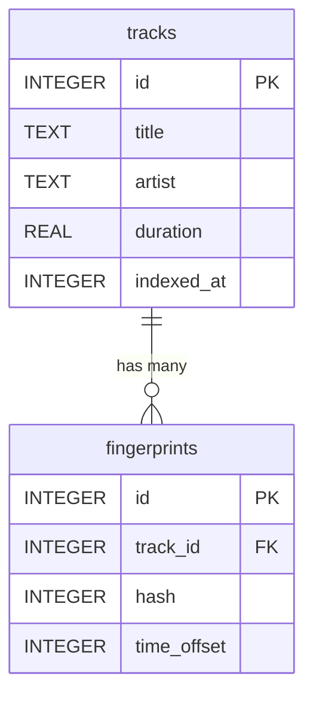

@page module_storage Модуль storage

[TOC]

@section storage_purpose Назначение

`storage/` содержит единственную конкретную реализацию хранилища —
`SQLiteRepository` — интерфейса `domain::ITrackRepository`. Domain-слой
работает только с интерфейсом, поэтому `storage` — единственное место,
которое нужно менять при смене СУБД (см. @ref arch_dec_sqlite в
@ref architecture).

@section storage_classes Классы

| Класс | Роль |
|---|---|
| `SQLiteRepository` | Реализация `ITrackRepository` поверх SQLite (через `sqlite3.h`) |

@section storage_schema Схема БД



Поле `fingerprints.time_offset` — индекс фрейма якорного пика в треке
(`Fingerprint::anchor_frame_`); используется при голосовании для вычисления
Δ. Внешний ключ `track_id` объявлен с `ON DELETE CASCADE`, поэтому
`DeleteTrack()` удаляет строку трека и все связанные fingerprints одним SQL-запросом.

Индексы: по `hash` (основной — используется в `FindMatches` при поиске
совпадений) и по `track_id` (вспомогательный, для каскадного удаления).

@section storage_concurrency WAL и конкурентность

При открытии соединения `SQLiteRepository::EnableWalMode()` включает
`PRAGMA journal_mode=WAL` — читатели (воркеры, выполняющие `FindMatches`) и
писатели (индексирование) не блокируют друг друга на уровне файла БД. Это
решает конкурентность **между процессами** (CLI `indexer` и HTTP-сервер
могут работать с одним файлом БД одновременно).

Конкурентность **внутри одного процесса** (несколько потоков `WorkerPool`
плюс, возможно, одновременный вызов admin-эндпоинта) закрывает
`std::mutex mutex_` — каждый публичный метод `SQLiteRepository` захватывает
его перед обращением к `sqlite3*`, так как объекты `sqlite3*` не
гарантированно потокобезопасны при конкурентных вызовах без сериализации на
уровне приложения.

@section storage_usage Пример использования

```cpp
#include "storage/sqlite_repository.h"

aid::storage::SQLiteRepository repo("tracks.db");  // или ":memory:" для тестов

std::size_t track_id = repo.AddTrackWithFingerprints(
    {"Title", "Artist", 210.5F}, fingerprints);

auto matches = repo.FindMatches(query_hashes);
auto tracks = repo.GetAllTracks();
repo.DeleteTrack(track_id);
```

@section storage_deps Зависимости

- Реализует интерфейс из `domain` (`domain::ITrackRepository`,
  `domain::TrackMetadata`, `domain::TrackInfo`, `domain::HashLookupResult`) —
  зависимость на `domain` идёт только за типами данных интерфейса.
- Использует тип `core::Fingerprint` напрямую (через `domain/i_track_repository.h`).
- Внешняя библиотека: `sqlite3` (системная, через `find_package(SQLite3)`).
- От `storage` зависит `server` (создаёт `SQLiteRepository` и передаёт его
  как `ITrackRepository&` в `IndexingService`/`MatchingService`) и CLI
  `indexer`.
